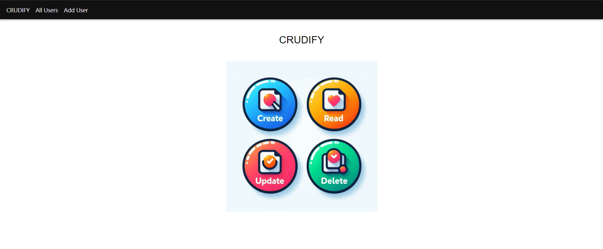
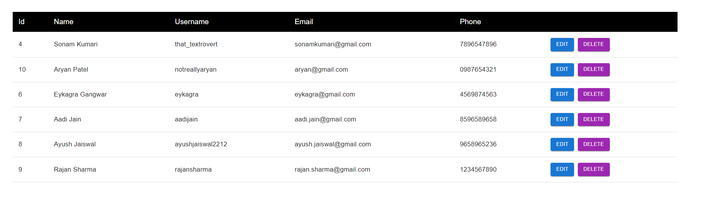
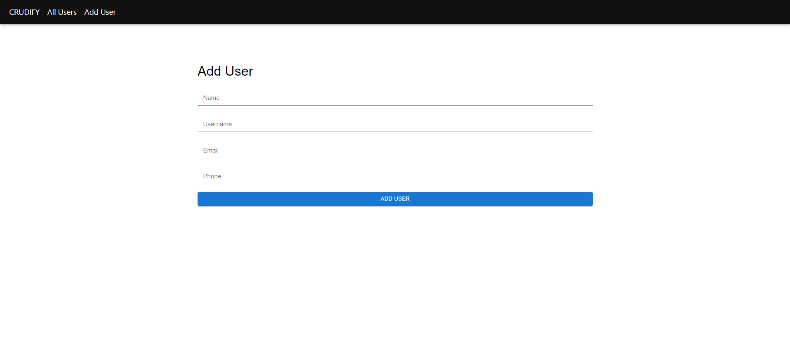

# Crudify

**Crudify** is a React.js application that implements CRUD (Create, Read, Update, Delete) operations. It leverages Material-UI (MUI) for design, Axios for HTTP requests, and React Router for navigation. This project provides a seamless way to manage and manipulate data in a user-friendly interface.

## Features

- **Create**: Add new data entries.
- **Read**: View existing data entries.
- **Update**: Modify existing data entries.
- **Delete**: Remove data entries.

## Technologies Used

- **React.js**: For building the user interface.
- **Material-UI (MUI)**: For styling and components.
- **Axios**: For making HTTP requests.
- **React Router**: For navigation and routing.

## Screenshots

### Home Screen


### All Users


### Add User



## Getting Started

To get started with the Crudify application, follow these steps:

### 1. Clone the Repository

```bash
git clone https://github.com/SonamKumari29/Crudify.git
```

### 2. Navigate to the Project Directory

```bash
cd Crudify
```

### 3. Install Dependencies

```bash
npm install
```

### 4. Run the Application

```bash
npm run dev
```

